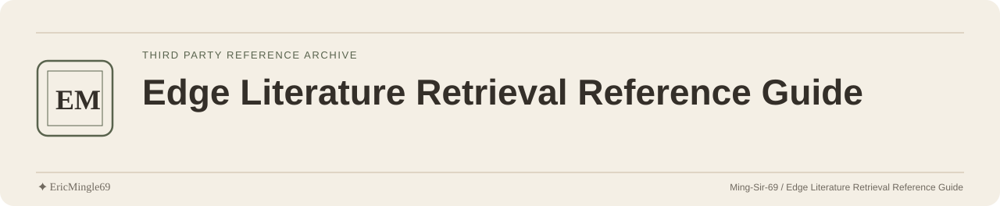

<picture>
  <source media="(prefers-color-scheme: dark)" srcset="readme-assets/header-dark.svg">
  <source media="(prefers-color-scheme: light)" srcset="readme-assets/header-light.svg">
  
</picture>

  <a href="README.md">简体中文</a> · <a href="README.en.md">English</a> · <a href="PERSONAL-NOTICE.md">✦ EricMingle69</a>

# Edge Literature Retrieval Reference Guide

A code and reference repository centered on Edge, Baidu Scholar and a Python graphical interface. This page identifies its entry points and original sources.

## Start with the source

The repository's [original author notes](介绍证书/README.md) credit “水论文的程序猿”.
The [read-first note](介绍证书/使用前必看.txt) points to the original project, [nickchen121/cyd-selected-journal](https://github.com/nickchen121/cyd-selected-journal).

The exact changes relative to that project have not been established. The repository maintainer's identity does not replace the original author's identity.

## Documentation entries

| Reference | Content |
| --- | --- |
| [Original author notes](介绍证书/README.md) | Original project introduction and source statements |
| [Read-first note](介绍证书/使用前必看.txt) | Existing reading notes and project source |
| [User guide](介绍证书/使用指南（必看）.pdf) | An included operating guide |
| [介绍证书/LICENSE](介绍证书/LICENSE) | License text included with the introductory materials |

## Code structure

These locations help explain the repository's structure:

- [主程序.py](主程序.py): graphical-interface entry code.
- [界面元素/](界面元素/): Tkinter interface and button handling.
- [功能/](功能/): web retrieval and file-processing code.
- [资源/](资源/): interface resources and browser-driver attachments.

The existing code depends on webpage structure and a browser driver. Dependency versions, environment compatibility and result completeness have not been verified.

## Sources and license scope

The repository retains source documents and multiple permission notices. Their respective scopes have not been confirmed.
The driver attachments have separate [third-party license](资源/驱动/Driver_Notes/LICENSE) and [EULA](资源/驱动/Driver_Notes/EULA) files.

Retain the original author and existing notices when reading or quoting the materials. This page provides reference navigation, does not interpret the relationship between those texts, and grants no additional rights to code, drivers or third-party materials.

---

Documentation maintained by **✦ EricMingle69** · [Ming-Sir-69](https://github.com/Ming-Sir-69)  
[Personal identity, licensing and permissions](PERSONAL-NOTICE.md) · The header follows your GitHub theme.
